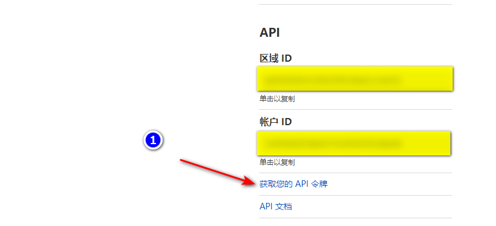

# x-ui

 bảng xray hỗ trợ đa giao thức và nhiều người dùng

 # Đặc trưng

 - Giám sát trạng thái hệ thống
 - Hỗ trợ đa người dùng và đa giao thức, thao tác hiển thị trang web
 - Các giao thức được hỗ trợ: vmess, vless, trojan, shadowsocks, dokodemo-door, socks, http
 - Hỗ trợ cấu hình nhiều cấu hình truyền tải hơn
 - Thống kê lưu lượng, giới hạn lưu lượng, giới hạn thời gian hết hạn
 - Các mẫu cấu hình xray có thể tùy chỉnh
 - Hỗ trợ bảng truy cập https (tự cung cấp tên miền + chứng chỉ ssl)
 - Hỗ trợ ứng dụng chứng chỉ SSL một cú nhấp chuột và gia hạn tự động
 - Đối với các mục cấu hình nâng cao hơn, hãy xem bảng điều khiển để biết chi tiết

 # Cài đặt & Nâng cấp

 ```
 bash <(curl -Ls https://raw.githubusercontent.com/vaxilu/x-ui/master/install.sh)
 ```

 ## Cài đặt & nâng cấp thủ công

 1. Trước tiên hãy tải xuống gói nén mới nhất từ ​​https://github.com/vaxilu/x-ui/releases, thường chọn kiến ​​trúc `amd64`
 2. Sau đó tải gói nén lên thư mục `/root/` của máy chủ và sử dụng người dùng `root` để đăng nhập vào máy chủ

 > Nếu kiến ​​trúc cpu máy chủ của bạn không phải là `amd64`, hãy thay thế `amd64` trong lệnh bằng kiến ​​trúc khác

 ```
 cd /gốc/
 rm x-ui/ /usr/local/x-ui/ /usr/bin/x-ui -rf
 tar zxvf x-ui-linux-AMD64.tar.gz
 chmod +x x-ui/x-ui x-ui/bin/xray-linux-* x-ui/x-ui.sh
 cp x-ui/x-ui.sh /usr/bin/x-ui
 cp -f x-ui/x-ui.service /etc/systemd/system/
 mv x-ui/ /usr/local/
 systemctl daemon-tải lại
 systemctl kích hoạt x-ui
 systemctl khởi động lại x-ui
 ```

 ## Cài đặt bằng docker

 > Hướng dẫn docker và hình ảnh docker này được cung cấp bởi [Chasing66](https://github.com/Chasing66)

 1. Cài đặt docker

 vỏ ```
 cuộn tròn -fsSL https://get.docker.com | sh
 ```

 2. Cài đặt x-ui

 vỏ ```
 mkdir x-ui && cd x-ui
 docker run -itd --network=host \
     -v $PWD/db/:/etc/x-ui/ \
     -v $PWD/cert/:/root/cert/\
     --name x-ui --restart=unless-stopped\
     enwaiax/x-ui:mới nhất
 ```

 > Xây dựng hình ảnh của riêng bạn

 vỏ ```
 docker build -t x-ui .
 ```

 ## Ứng dụng chứng chỉ SSL

 > Chức năng và hướng dẫn này được cung cấp bởi [FranzKafkaYu](https://github.com/FranzKafkaYu)

 Tập lệnh này có chức năng ứng dụng chứng chỉ SSL tích hợp. Để sử dụng tập lệnh này để đăng ký chứng chỉ, các điều kiện sau phải được đáp ứng:

 - Biết địa chỉ email đã đăng ký Cloudflare
 - Biết khóa API toàn cầu của Cloudflare
 - Tên miền đã được phân giải về máy chủ hiện tại thông qua cloudflare

 Cách nhận Khóa API toàn cầu của Cloudflare:
     
     

 Khi sử dụng bạn chỉ cần nhập `tên miền`, `email`, `API KEY`, sơ đồ như sau:
         

 Các biện pháp phòng ngừa:

 - Tập lệnh sử dụng API DNS cho các yêu cầu chứng chỉ
 - Sử dụng Let'sEncrypt làm bên CA theo mặc định
 - Thư mục cài đặt chứng chỉ là thư mục /root/cert
 - Các chứng chỉ được áp dụng bởi tập lệnh này là tất cả các chứng chỉ tên miền hoang dã

 ## Sử dụng robot Tg (đang được phát triển, tạm thời không khả dụng)

 > Chức năng và hướng dẫn này được cung cấp bởi [FranzKafkaYu](https://github.com/FranzKafkaYu)

 X-UI hỗ trợ thông báo giao thông hàng ngày, nhắc nhở đăng nhập bảng điều khiển và các chức năng khác thông qua Tg robot. Để sử dụng Tg robot, bạn cần tự đăng ký
 Để biết các hướng dẫn ứng dụng cụ thể, vui lòng tham khảo [liên kết blog] (https://coderfan.net/how-to-use-telegram-bot-to-alarm-you-when-someone-login-into-your-vps.html )
 Hướng dẫn sử dụng: Đặt các thông số liên quan đến rô bốt ở chế độ nền của bảng điều khiển, bao gồm

 - Mã thông báo robot Tg
 - Tg Bot ChatId
 - Thời gian chạy chu kỳ robot Tg, sử dụng cú pháp crontab

 Cú pháp tham khảo:
 - 30 * * * * * //Thông báo vào ngày 30 hàng tháng
 - @hourly // thông báo hàng giờ
 - @daily //Thông báo mỗi ngày (0:00 AM)
 - @every 8h // thông báo 8h một lần

 Nội dung thông báo TG:
 - Sử dụng lưu lượng nút
 - Bảng nhắc nhở đăng nhập
 - Nhắc nhở hết hạn nút
 - Nhắc nhở cảnh báo giao thông

 Nhiều chức năng hơn được lên kế hoạch...
 ## Hệ thống gợi ý

 - CentOS 7+
 - Ubuntu16+
 - Debian 8+

 # vấn đề thường gặp

 ## Di chuyển từ v2-ui

 Trước tiên, hãy cài đặt phiên bản x-ui mới nhất trên máy chủ đã cài đặt v2-ui, sau đó sử dụng lệnh sau để di chuyển, lệnh này sẽ di chuyển `tất cả dữ liệu tài khoản gửi đến` của v2-ui của máy này sang x-ui, ` cài đặt bảng điều khiển và tên người dùng và mật khẩu sẽ không di chuyển`

 > Sau khi quá trình di chuyển thành công, vui lòng `đóng v2-ui` và `khởi động lại x-ui`, nếu không, đầu vào của v2-ui và đầu vào của x-ui sẽ tạo ra `xung đột cổng`

 ```
 x-ui v2-ui
 ```

 ## sự cố đã đóng

 Tất cả các loại vấn đề màu trắng xem huyết áp cao

 ## Stargazers theo thời gian

 [](https://starchart.cc/vaxilu/x-ui)
